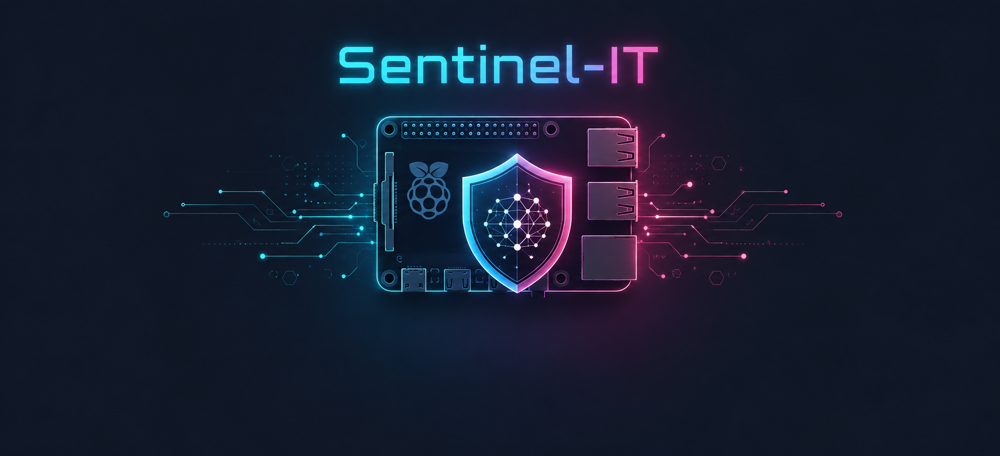

# Projects

Proyectos destacados del portfolio.

## Sentinel-IT

SOC autónomo y distribuido sobre dos nodos Raspberry Pi, con comunicación MQTT/mTLS, dashboard Flask y análisis asistido por IA. AWS IoT Core se usa como parte de la arquitectura del proyecto final, no como eje principal del portfolio.

[Ver proyecto](./final-project/)
